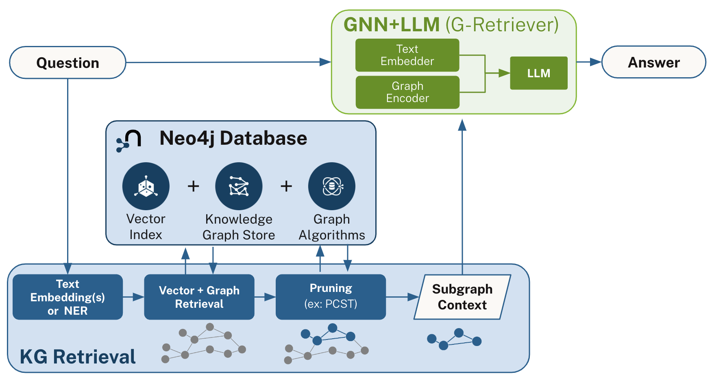
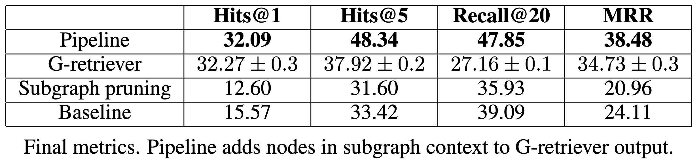

# Neo4j GraphRAG with GNN+LLM

__Knowledge graph retrieval to improve multi-hop Q&A performance, optimized with GNN + LLM models.__

This repo contains experiments for combining Knowledge Graph Retrieval with GNN+LLM models to improve RAG.  Currently leveraging [Neo4j](https://neo4j.com/generativeai/), [G-Retriever](https://arxiv.org/abs/2402.07630), and the [STaRK-Prime dataset](https://stark.stanford.edu/dataset_prime.html) for benchmarking. 

This work was presented at: 
stanford graph learning workshop 2024: https://snap.stanford.edu/graphlearning-workshop-2024/
nvidia technical blog: https://developer.nvidia.com/blog/boosting-qa-accuracy-with-graphrag-using-pyg-and-graph-databases/

## Architecture Overview



- RAG on large knowledge graphs that require multi-hop retrieval and reasoning, beyond node classification and link prediction.
- General, extensible 2-part architecture: KG Retrieval & GNN+LLM.
- Efficient, stable inference time and output for real-world use cases.

## Installation

### Installing Neo4J

Install the Neo4j database (and relevant JDK) by following [official instructions](https://neo4j.com/docs/operations-manual/current/installation/linux/debian/#debian-installation).

Once installed, you can verify the installation version 

```bash
neo4j --version
```

Then start your Neo4J instance via

```bash
neo4j start
```
```
Directories in use:
home:         /var/lib/neo4j
config:       /etc/neo4j             <-- location of config file
logs:         /var/log/neo4j
plugins:      /var/lib/neo4j/plugins <-- location of plugins in neo4j home
import:       /var/lib/neo4j/import
data:         /var/lib/neo4j/data
certificates: /var/lib/neo4j/certificates
licenses:     /var/lib/neo4j/licenses
run:          /var/lib/neo4j/run
Starting Neo4j.
```

From this output, you can see information about where Neo4J has been installed:

### Installing Additional Plugins

You'll also need to install the following:
 - [GenAI plugin](https://neo4j.com/docs/cypher-manual/current/genai-integrations/#_installation)
 - [Graph Data Science library](https://neo4j.com/docs/graph-data-science/current/installation/)

This can be done by moving the `<plugin>.jar` files from the `products/` directory into the `plugins/` directory in your Neo4J home. Also add the following line

```
dbms.security.procedures.allowlist=gds.*
```

To the bottom of your Neo4J config file (`/etc/neo4j/neo4j.conf`) and restart Neo4J.

```bash
neo4j restart
```


### The database & dataset

With the database installed and running, you can load the STaRK-Prime dataset by running the python notebook in `data-loading/stark_prime_neo4j_loading.ipynb`.

__Alternatives__:

- Run the notebook as a script

```bash
python load_data.py
```

This was done by converting the notebook into a script.
```bash
jupyter nbconvert --to script stark_prime_neo4j_loading.ipynb
```

- Obtain a database dump at AWS S3 (bucket at gds-public-dataset/stark-prime-neo4j523) for database version 5.23.

### Other requirements

Install all required libraries in `requirements.txt` with `pip install -r requirements.txt`.

They should be compatible with Python 3.11.

Populate `db.env` file with your local Neo4j URI and username and password.
Additionally, make sure huggingface-cli authentications are set up for using relevant (Llama2, Llama3) models.


## Reproduce results
1. To train a model with default configurations, run the following command:
`python train.py --checkpointing --llama_version llama3.1-8b --retrieval_config_version 0 --algo_config_version 0 --g_retriever_config_version 0 --eval_batch_size 4`
2. To get result for Pipline, run `eval_pcst_ordering.ipynb` on using the intermediate dataset and g-retriever model.
3. To exactly reproduce results in the below table, use the `stanford-workshop-2024` branch. 
The `main` branch contains new incremental changes and improvements.
   



## Additional Neo4j GraphRAG Resources
- For a high-level overview of Neo4j & GenAI, have a look at [neo4j.com/genai](http://neo4j.com/genai).
- To learn how to get started using LLMs with Neo4j see [this online Graph Academy course](https://graphacademy.neo4j.com/courses/llm-fundamentals/) which is one of many [Neo4j-GenAI courses](https://graphacademy.neo4j.com/categories/llms/) covering multiple topics ranging from KG construction, to graph+vector search, and building GenAI chatbot applications.
- Pick your [GenAI framework of choice](https://neo4j.com/developer/genai-ecosystem/genai-frameworks/) to start building your own GenAI applications with Neo4j.
- Check out [Neo4j GenAI technical blogs](https://neo4j.com/developer-blog/tagged/genai/) for other worked examples and integrations.

